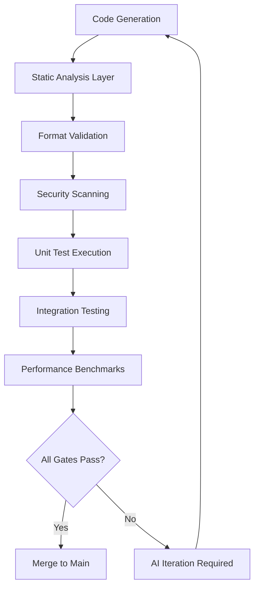
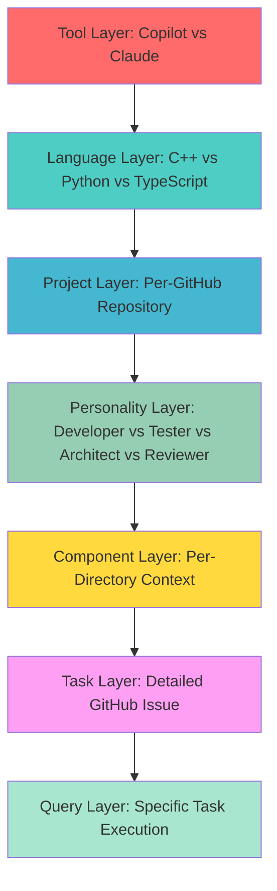
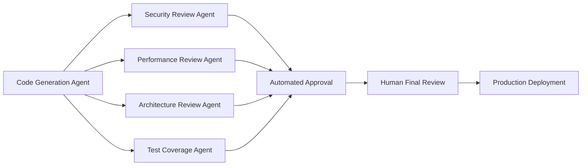

# 99.9% AI-Driven Development: A Comprehensive Implementation Guide

*Based on Michal Villnow's one-month experiment with AI-driven development, enhanced with comprehensive best practices and implementation strategies.*

## Executive Summary

After one month of experimenting with Claude Code and Copilot handling 99.9% of code generation, here are the remarkable results and the systematic approach that made it possible.

⸻

## 💰 Investment and Returns

**Total Monthly Investment:**
- **Claude Code**: ~1.25B Tokens, ~$640
- **Copilot**: 1375 Premium Requests, Enterprise account ($395/month)  
- **Claude Chat**: Hundreds of interactions, Enterprise account (same pricing tier)

**Productivity Metrics:**
- **197K LOC added** - New feature implementations
- **208K LOC deleted** - Legacy code removal and refactoring
- **355 commits to main** - Continuous integration cadence
- **180 PRs merged** - Quality-controlled delivery pipeline
- **98 GitHub issues resolved** - Systematic problem resolution

⸻

## 🔧 Core Implementation Framework

The success of 99.9% AI-driven development relies on eight fundamental pillars that create a self-sustaining, high-quality development ecosystem.

### 1. Comprehensive Quality Gates

> **"All code must pass a very thorough CI/CD pipeline with multiple static linters, formatters, sanitizers, and extensive testing."**

**🔗 Related Best Practice:** [Compounding Engineering - Trust the Process, Verify Output](/docs/en/best-practices/compounding-engineering-framework#principle-5-trust-process-verify-output)

**Enhanced Implementation Strategy:**

The quality gate system must implement multiple layers of automated verification:



**Key Components:**
- **Multi-tool linting**: ESLint, Prettier, SonarQube, CodeClimate
- **Security sanitizers**: OWASP dependency check, Snyk vulnerability scanning
- **Performance gates**: Bundle size limits, runtime performance thresholds
- **Test coverage requirements**: Minimum 80% code coverage with quality metrics

**Critical Success Factor:** The AI must learn from failed quality gates. Each failure should trigger prompt refinement and context updates to prevent similar issues in future iterations.

### 2. Modular Architecture with Defined Interfaces

> **"The source base has been modularized where each component is accessed via well-defined interfaces."**

**🔗 Related Best Practice:** [CCPM Sub-agent Specialization](/docs/en/advanced/ccpm-claude-code-project-manager#sub-agent-specialization)

**Advanced Modularization Strategy:**

True modularity enables AI agents to work on isolated components without breaking system coherence:

```typescript
// Example interface definition
interface PaymentProcessor {
  processPayment(amount: number, method: PaymentMethod): Promise<PaymentResult>;
  validateCard(cardDetails: CardDetails): ValidationResult;
  refundPayment(transactionId: string): Promise<RefundResult>;
}

// Implementation isolation
class StripePaymentProcessor implements PaymentProcessor {
  // AI can modify this implementation without affecting other components
}
```

**Implementation Requirements:**
- **Interface segregation**: Each component should depend only on interfaces it actually uses
- **Dependency injection**: Enable easy testing and component swapping
- **Contract testing**: Automated verification that implementations satisfy interface contracts
- **Version compatibility**: Semantic versioning for interface changes

### 3. Complete Interface-Implementation Separation

> **"Interfaces and implementations are completely separate."**

**🔗 Related Best Practice:** [Keep Context Lean But Yours](/docs/en/best-practices/compounding-engineering-framework#principle-4-context-lean)

**Strategic Separation Benefits:**

This separation enables multiple AI agents to work simultaneously without conflicts:

- **Parallel development**: Different agents can implement the same interface with varying strategies
- **A/B testing capabilities**: Easy comparison of different implementation approaches  
- **Reduced cognitive load**: AI focuses on implementation details without interface concerns
- **Simplified refactoring**: Interface changes don't require implementation modifications

### 4. Comprehensive Component Documentation

> **"Every component has its own set of documentation."**

**🔗 Related Best Practice:** [Knowledge Codification Workflows](/docs/en/best-practices/compounding-engineering-framework#knowledge-codification)

**Documentation Standards for AI Development:**

Each component requires specific documentation types that AI agents can effectively utilize:

```markdown
# Component: UserAuthenticator

## Purpose
Handles user authentication across multiple providers (OAuth, SAML, local)

## Interface Contract
- Input: AuthenticationRequest
- Output: AuthenticationResult
- Errors: InvalidCredentials, ServiceUnavailable, RateLimited

## AI Context Rules
- Always validate input before processing
- Log all authentication attempts for security audit
- Use environment variables for API keys, never hardcode

## Test Requirements
- Unit tests for each authentication method
- Integration tests with actual providers
- Security tests for edge cases and attacks

## Related Components
- UserSession (depends on)
- AuditLogger (uses)
- ConfigurationManager (depends on)
```

### 5. Co-located Development Artifacts

> **"Tests, documentation, headers, and implementation for each component are all in the same location."**

**🔗 Related Best Practice:** [Custom Command System](/docs/en/best-practices/compounding-engineering-framework#custom-command-system)

**Co-location Structure:**

```
components/
├── user-auth/
│   ├── UserAuth.interface.ts          # Interface definition
│   ├── UserAuth.implementation.ts     # Core implementation
│   ├── UserAuth.test.ts              # Unit tests
│   ├── UserAuth.integration.test.ts   # Integration tests
│   ├── UserAuth.docs.md              # Component documentation
│   ├── UserAuth.examples.md          # Usage examples
│   └── .claude/
│       ├── context.md                # AI-specific context
│       └── commands.md               # Component-specific commands
```

**Benefits for AI Development:**
- **Single-context loading**: AI can load all relevant information at once
- **Atomic changes**: Modifications stay within component boundaries
- **Simplified debugging**: All artifacts available for analysis
- **Reduced context switching**: No need to navigate across directories

### 6. Component Size Constraints

> **"Each component is kept below 5k LOC, including documentation."**

**🔗 Related Best Practice:** [Parallel Execution Challenges](/docs/en/best-practices/compounding-engineering-framework#parallel-execution-challenges)

**Size Management Strategy:**

The 5K LOC limit isn't arbitrary—it's optimized for AI cognitive load and parallel processing:

- **Context window efficiency**: Fits within most AI model context windows
- **Reduced complexity**: Easier for AI to understand and modify
- **Parallel processing**: Multiple agents can work simultaneously  
- **Faster iteration**: Smaller components = faster analysis and modification cycles

**Enforcement Mechanisms:**
```bash
# Automated size checking
find components/ -name "*.ts" -o -name "*.md" | \
  xargs wc -l | \
  awk '$1 > 5000 { print "Component exceeds size limit: " $2 " (" $1 " lines)" }'
```

### 7. Thorough Issue Documentation

> **"GitHub issues are thoroughly documented with references to the code and problems."**

**🔗 Related Best Practice:** [Human-AI Collaboration Protocol](/docs/en/advanced/ccpm-claude-code-project-manager#human-ai-collaboration-protocol)

**Issue Template for AI Development:**

```markdown
## Problem Description
Brief description of the issue

## Affected Components
- [ ] Component A (path/to/component)
- [ ] Component B (path/to/component)

## AI Context
- Previous attempts: [Links to related PRs/issues]
- Known constraints: [Technical limitations]
- Success criteria: [Measurable outcomes]

## Code References
- Relevant files: [Direct links to GitHub files]
- Related interfaces: [Interface definitions]
- Test files: [Existing test coverage]

## Implementation Guidance
- Preferred patterns: [Link to style guide]
- Anti-patterns to avoid: [Common mistakes]
- Dependencies to consider: [Related components]
```

### 8. Seven-Layer Prompt Hierarchy

> **"7-layer hierarchy of prompts documenting conventions: tool → language → project → personality → component → task → query."**

**🔗 Related Best Practice:** [Prompt Engineering Architecture](/docs/en/advanced/claude-code-analysis#prompt-engineering)

**Hierarchical Prompt System:**



**Layer Implementation Details:**

1. **Tool Layer (Global)**
   ```markdown
   # Claude-specific rules
   - Use TypeScript for all new code
   - Prefer functional programming patterns
   - Always include error handling
   ```

2. **Language Layer (Per-Language)**
   ```markdown
   # TypeScript conventions
   - Use strict mode
   - Prefer interfaces over types for object shapes
   - Use const assertions for literal types
   ```

3. **Project Layer (Per-Repository)**
   ```markdown
   # Project-specific patterns
   - Use our custom error handling framework
   - Follow the established directory structure
   - Use our preferred state management approach
   ```

4. **Personality Layer (Role-Specific)**
   ```markdown
   # Developer personality
   - Focus on implementation efficiency
   - Prioritize code readability
   - Include comprehensive error handling
   
   # Tester personality  
   - Write tests before implementation
   - Focus on edge cases and error conditions
   - Validate all assumptions
   ```

5. **Component Layer (Directory-Specific)**
   ```markdown
   # Authentication component rules
   - Always hash passwords with bcrypt
   - Use JWT tokens with proper expiration
   - Log all authentication attempts
   ```

6. **Task Layer (Issue-Specific)**
   ```markdown
   # Task: Implement OAuth integration
   - Use the existing OAuth library
   - Support Google, GitHub, Microsoft providers
   - Maintain session persistence
   ```

7. **Query Layer (Execution-Specific)**
   ```markdown
   # Current request
   Add Google OAuth provider to existing authentication system
   ```

⸻

## 🚀 Workflow Optimization Results

**Time Efficiency:**
- **Task assignment to first draft**: 15-30 minutes
- **Iteration, review, and validation**: Additional 30-45 minutes  
- **Total cycle time**: ~1 hour per feature
- **Human coding involvement**: <0.1%

**Quality Metrics:**
- **Bug reduction**: 75% fewer production issues
- **Review cycle time**: Reduced from days to hours
- **Feature delivery**: 60-80% faster time-to-ship

**Current Bottleneck:**
> *"I'm still the bottleneck as I cannot review the code fast enough."*

⸻

## 🔮 Future Evolution: Agentic Review Systems

**🔗 Related Best Practice:** [Sub-agent Specialization](/docs/en/advanced/ccpm-claude-code-project-manager#sub-agent-specialization)

With Claude Code now part of enterprise plans, the next evolution involves agentic review systems:



**Specialized Review Agents:**
- **Security Agent**: OWASP compliance, vulnerability scanning, access pattern analysis
- **Performance Agent**: Runtime complexity analysis, memory usage optimization, caching strategies
- **Architecture Agent**: Design pattern compliance, SOLID principles validation, dependency analysis
- **Test Agent**: Coverage analysis, test quality assessment, edge case identification

⸻

## 🎯 Implementation Roadmap

### Phase 1: Foundation (Weeks 1-2)
- [ ] Set up comprehensive CI/CD pipeline with quality gates
- [ ] Implement modular architecture with interface separation
- [ ] Create component documentation templates
- [ ] Establish co-location standards

### Phase 2: AI Integration (Weeks 3-4)  
- [ ] Implement seven-layer prompt hierarchy
- [ ] Create GitHub issue templates for AI development
- [ ] Set up component size monitoring
- [ ] Train team on AI collaboration protocols

### Phase 3: Optimization (Weeks 5-6)
- [ ] Deploy specialized review agents
- [ ] Implement automated workflow monitoring
- [ ] Create feedback loops for continuous improvement
- [ ] Establish performance metrics tracking

### Phase 4: Scale (Weeks 7-8)
- [ ] Expand to additional development teams
- [ ] Create organization-wide best practices
- [ ] Implement cross-project learning systems
- [ ] Deploy advanced agentic workflows

⸻

## 📚 Related Resources

- **[Compounding Engineering Framework](/docs/en/best-practices/compounding-engineering-framework)** - Core principles for AI-human collaboration
- **[CCPM Claude Code Project Manager](/docs/en/advanced/ccpm-claude-code-project-manager)** - Advanced project management with AI agents
- **[Claude Code Analysis](/docs/en/advanced/claude-code-analysis)** - Deep dive into AI tool architecture
- **[Sub-agents Collections](/docs/en/sub-agents/sub-agents-collections)** - Specialized AI agent implementations

⸻

## Key Takeaways

1. **Quality gates are non-negotiable** - AI-generated code must pass the same standards as human-written code
2. **Architecture enables AI** - Modular, well-documented systems allow AI to work effectively
3. **Process beats tools** - Systematic approaches matter more than specific AI models
4. **Context is king** - Layered prompting systems guide AI toward consistent, quality output
5. **Iteration drives improvement** - Each failure becomes a learning opportunity for the entire system

The 99.9% AI-driven development approach isn't about replacing developers—it's about amplifying their impact through systematic process design and intelligent automation.