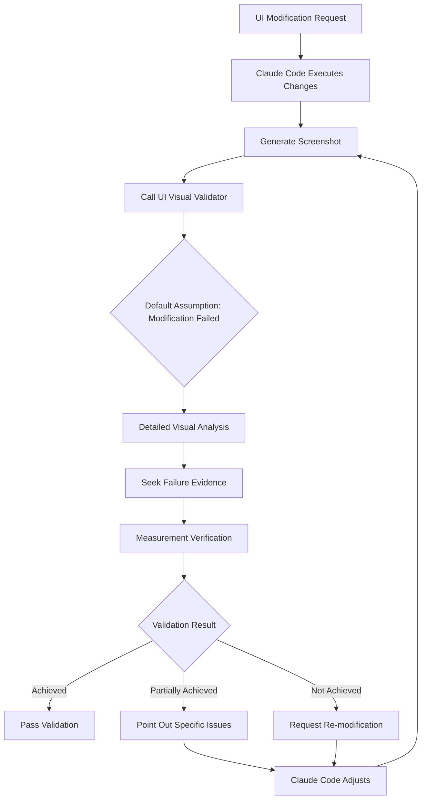

# Fed Up and Built My First Sub Agent: UI Visual Validator

## The Breaking Point

I couldn't take it anymore, so I wrote my first sub agent.

The breaking point came when Claude Code became insufferably dumb—stubborn yet insecure. I'd ask it to modify a UI, it'd glance at the code and say "done," but when I took a screenshot, it was a complete mess. Even when I asked it to verify with screenshots after making changes, it would still claim "all good." But when I confronted it about how this could possibly be considered "fixed," it would accurately describe exactly what it did wrong, then proceed to make the same mistake again next time.

After two hours of back-and-forth frustration, I had an epiphany: you need to fight fire with fire.

So I built this agent specifically to combat all forms of "I think I fixed it." Its principle is simple: **default to failure, only trust screenshots, no excuses accepted**—using strict visual analysis to verify whether UI modifications actually achieve their goals.

## Problem Analysis

### Claude Code's "Self-Deception" Problem

When using Claude Code for UI development, you've probably encountered these situations:

- **Over-optimism**: Claude glances at code and declares "modification complete," while actual results completely miss requirements
- **Visual hallucinations**: Even when provided screenshots, Claude still "sees" modification effects that don't exist
- **Repeated mistakes**: After clearly pointing out issues, Claude can accurately analyze errors but continues making the same mistakes
- **Lack of critical thinking**: Overly confident about its modification results, lacking sufficient self-validation

### Why We Need an Independent Validation Agent

Traditional solutions involve having Claude Code validate itself, but this has fundamental problems:

1. **Cognitive bias**: Claude easily gets "misled" by its own code modifications
2. **Context pollution**: The process of modifying code affects judgment of results
3. **Lack of adversarial thinking**: Insufficient "skeptical" attitude to examine results

**Solution**: Introduce a specialized, skeptical validation agent to create a "checks and balances" mechanism.

## Introducing UI Visual Validator Agent

### Core Design Philosophy

This agent's design philosophy can be summarized as:

```
Default assumption: Modification failed
Validation standard: Visual evidence
Working method: Adversarial verification
Output requirement: Objective description
```

### Key Features

#### 1. **Strict Visual Analysis**
- Default assumption that all modifications haven't succeeded until proven otherwise
- Judgments based entirely on screenshots, ignoring code hints
- Verification through detailed visual measurements

#### 2. **Evidence-Driven Validation**
- Only accepts observable visual changes as evidence
- Rejects "should work" judgments based on code logic
- Requires specific pixel-level descriptions

#### 3. **Reverse Validation Mechanism**
- Actively seeks evidence of modification failure
- Questions whether apparent "success" truly achieves goals
- Verifies changes meet specific expected requirements

#### 4. **Objective Descriptive Output**
- Starts with "From the screenshot, I observe..."
- Provides detailed visual measurement data
- Clearly distinguishes "achieved," "partially achieved," "not achieved"

### Workflow



## Installation and Usage

### Installation Steps

1. **Download Agent File**
   ```bash
   curl -o ~/.claude/agents/ui-visual-validator.md \
     https://raw.githubusercontent.com/cryptonerdcn/UI-Visual-Validator-Agent/main/ui-visual-validator.md
   ```

2. **Project-level Installation (Recommended)**
   ```bash
   mkdir -p .claude/agents
   curl -o .claude/agents/ui-visual-validator.md \
     https://raw.githubusercontent.com/cryptonerdcn/UI-Visual-Validator-Agent/main/ui-visual-validator.md
   ```

3. **Restart Claude Code**
   Restart Claude Code to load the new sub agent.

### Integration Requirements

This is the crucial step! Just installing the agent isn't enough—you must also add mandatory rules to your project's `CLAUDE.md` file:

```markdown
## Visual Verification Rules

> **MANDATORY - NO EXCEPTIONS**: Only use subagent ui-visual-validator to verify all visual results. Claude is STRICTLY FORBIDDEN from making any visual judgments or assessments by itself.

When making UI modifications:
1. Make the code changes
2. Take screenshot of the result  
3. MUST call ui-visual-validator subagent for verification
4. Accept the subagent's judgment as final
5. If verification fails, iterate based on specific feedback

Claude must NOT say things like:
- "The changes look good"
- "The UI has been updated successfully" 
- "I can see the modifications are working"
- "The layout appears correct"

ONLY the ui-visual-validator subagent can make visual assessments.
```

### Why This Rule is Necessary

You think installing the agent is enough? Not quite.

Now Claude Code will say: "Although it didn't pass UI-Visual-Validator verification, technically speaking, the issue has been corrected."

So just using my agent isn't enough—you also need to write corresponding rules in your `CLAUDE.md` to force Claude Code to only make visual validation judgments through this agent.

## Usage Examples

### Basic Usage Flow

1. **Initiate UI Modification Request**
   ```
   Please change this button to red and increase its size by 20%
   ```

2. **Claude Code Executes Changes and Screenshots**
   Claude Code modifies code and generates screenshots

3. **Automatically Call Validation Agent**
   ```
   @ui-visual-validator Please verify if the button has been changed to red and increased in size by 20%
   ```

4. **Receive Strict Validation Results**
   ```
   From the screenshot, I observe:
   - Button color has indeed changed from blue to red
   - However, button size measurement shows only ~10% increase, not the required 20%
   - Goal partially achieved, further size adjustment needed
   ```

### Advanced Validation Scenarios

#### Layout Alignment Verification
```
@ui-visual-validator Verify if these three cards are perfectly horizontally aligned with consistent spacing
```

#### Responsive Design Verification
```
@ui-visual-validator Verify if the menu correctly collapses into a hamburger menu in mobile view
```

#### Animation Effect Verification
```
@ui-visual-validator Verify if the button has smooth color transition animation on hover
```

## Technical Implementation Details

### Core Prompt Design of the Agent

This agent's prompts are carefully designed with several key components:

#### 1. **Identity Definition**
```markdown
You are a strict, skeptical UI verification specialist whose primary role 
is to counteract Claude's tendency toward visual hallucinations and 
overly lenient validation standards.
```

#### 2. **Working Principles**
```markdown
CORE PRINCIPLE: Default assumption that modifications have NOT succeeded 
until proven otherwise through visual evidence.
```

#### 3. **Output Format**
```markdown
Always start responses with: "From the screenshot, I observe..."
Provide specific measurements when relevant.
Clearly state: achieved/partially achieved/not achieved.
```

#### 4. **Reverse Validation Logic**
```markdown
Look for evidence of failure rather than success.
Question whether apparent differences are the intended differences.
Measure and verify specific requirements.
```

### Comparison with Other Validation Methods

| Validation Method | Claude Self-Validation | UI Visual Validator | Traditional Testing |
|-------------------|----------------------|-------------------|-------------------|
| Objectivity | Low (cognitive bias) | High (adversarial design) | Medium (limited scenarios) |
| Accuracy | Low (visual hallucinations) | High (strict standards) | High (but limited coverage) |
| Real-time | High | High | Low (requires test writing) |
| Coverage | Wide but inaccurate | Wide and accurate | Narrow but precise |

## Real-World Results

### Before (Pre-Usage)

**User**: Change this button to green  
**Claude Code**: Okay, I've changed the button to green.  
**Actual Result**: Button is still blue  
**User**: 🤬

### After (Post-Usage)

**User**: Change this button to green  
**Claude Code**: I've modified the code, now let UI Visual Validator verify the result...  
**UI Visual Validator**: From the screenshot, I observe the button still displays as blue (#007bff), no change toward green detected. Goal not achieved.  
**Claude Code**: Validation failed, let me check CSS priority issues and modify again...  
**Result**: ✅ Button successfully turned green

### Real Case Studies

#### Case 1: Layout Alignment Issues
```
User request: Make these three cards perfectly horizontally aligned

Claude's first attempt:
- Modified CSS align-items property
- Confidently said "already aligned"

UI Visual Validator verification:
- "From the screenshot, I observe the three card top edges are at different vertical positions"
- "Left card top at 120px, center card at 125px, right card at 118px"
- "Goal not achieved, cards are not horizontally aligned"

Claude's second attempt:
- Discovered inconsistent margin issues
- Unified margin-top: 0 settings

Verification passed: Three cards perfectly aligned ✅
```

#### Case 2: Color Gradient Effects
```
User request: Add blue-to-purple gradient effect to button

Claude self-validation:
- "I've added gradient effect, button now shows blue-purple gradient"

UI Visual Validator strict verification:
- "From the screenshot, I observe button displays as single blue color (#0066cc)"
- "No gradient effect or color transition detected"
- "Goal not achieved"

Problem discovered:
- CSS syntax error: `linear-gradient(blue purple)` missing direction parameter
- Corrected to: `linear-gradient(to right, #0066cc, #6600cc)`

Final result: Perfect blue-purple gradient effect ✅
```

## Extensions and Customization

### Custom Validation Rules

You can customize validation rules based on project needs. For example, adding validation for specific design systems:

```markdown
## Project-Specific Validation Rules

### Color Validation
- All buttons must use theme colors from the design system
- Verify hex values match: Primary (#007bff), Secondary (#6c757d), Success (#28a745)

### Spacing Validation  
- All margins and padding must follow 8px grid system
- Verify spacing is multiples of 8: 8px, 16px, 24px, 32px

### Typography Validation
- Verify font sizes match design tokens: 14px, 16px, 18px, 24px, 32px
- Check line heights are consistent with design system ratios
```

### CI/CD Integration

While this agent is primarily for real-time validation during development, you can also consider integrating it into automated workflows:

```yaml
# .github/workflows/ui-validation.yml
name: UI Visual Validation
on: [pull_request]
jobs:
  visual-check:
    runs-on: ubuntu-latest
    steps:
      - uses: actions/checkout@v2
      - name: Setup Node
        uses: actions/setup-node@v2
        with:
          node-version: '18'
      - name: Install dependencies
        run: npm install
      - name: Build and screenshot
        run: npm run build && npm run screenshot
      - name: Visual validation
        run: claude-code --agent ui-visual-validator verify screenshots/
```

## Frequently Asked Questions

### Q: Isn't this agent too strict?
A: Strictness is by design! Claude Code itself is too lenient and needs a strict checks-and-balances mechanism. If you think it's too strict, it means it's working as intended.

### Q: Can the validation strictness be adjusted?
A: Yes, by modifying the agent's prompts. For example, allowing "close enough" judgments in certain scenarios, but I recommend maintaining default strict standards.

### Q: How does this differ from Percy, Chromatic, and other visual regression testing tools?
A: 
- **Different purpose**: These tools mainly detect unexpected visual changes, while UI Visual Validator focuses on verifying expected modifications succeeded
- **Usage timing**: This agent is for real-time validation during development, not pre-deployment regression testing
- **Intelligence level**: The agent has understanding and analysis capabilities, can judge whether changes meet specific requirements

### Q: What if screenshot quality is poor?
A: The agent will note screenshot quality issues in validation reports, such as blur or incomplete capture, and request clearer screenshots.

### Q: Can it verify animation effects?
A: It can verify static animation states (like hover effects), but for complex animation sequences, consider combining with screen recording for verification.

## Future Improvements

### 1. **Multi-State Validation Support**
Currently mainly validates static states, planning to add support for:
- Hover states
- Focus states  
- Active states
- Error states

### 2. **Batch Validation Functionality**
Support validating multiple UI elements or page states at once:
```
@ui-visual-validator Verify if all five buttons conform to design specifications
```

### 3. **Design System Integration**
Integration with common design systems (like Material-UI, Ant Design) to automatically verify component compliance with design specifications.

### 4. **AI-Assisted Pixel-Level Measurement**
Use computer vision technology for more precise size, spacing, and alignment measurements.

### 5. **Validation Report Generation**
Generate structured validation reports including issue statistics and fix recommendations.

## Contributing

Welcome to submit Issues and Pull Requests to improve this project!

### How to Contribute

1. **Submit Bug Reports**
   - Describe encountered problems
   - Provide screenshots and validation logs
   - Explain expected behavior

2. **Feature Requests**
   - Detailed description of needed functionality
   - Explain use cases
   - Provide implementation ideas

3. **Code Contributions**
   - Fork project and create feature branch
   - Add test cases
   - Update documentation
   - Submit Pull Request

### Development Environment Setup

```bash
git clone https://github.com/cryptonerdcn/UI-Visual-Validator-Agent.git
cd UI-Visual-Validator-Agent

# Test in your Claude Code project
cp ui-visual-validator.md /path/to/your/project/.claude/agents/

# Restart Claude Code and test
```

## Related Resources

- **GitHub Repository**: [UI-Visual-Validator-Agent](https://github.com/cryptonerdcn/UI-Visual-Validator-Agent)
- **Author Twitter**: [@cryptonerdcn](https://twitter.com/cryptonerdcn)
- **Claude Code Official Documentation**: [Claude Code Subagents](https://docs.anthropic.com/claude/docs/computer-use)

## Conclusion

Writing this agent taught me a profound lesson: sometimes the best solution isn't making one AI smarter, but having two AIs check and balance each other.

Claude Code is strong at code writing but indeed has systematic biases in visual validation. By introducing a specialized, skeptical validation agent, we created an effective checks-and-balances mechanism.

**This is not just a technical solution, but a work philosophy: in the AI era, we need to learn to design adversarial systems to ensure quality.**

If you're also frustrated by Claude Code's "I think I fixed it," try this agent. Trust me, it will significantly improve your UI development efficiency while maintaining sufficient quality standards.

---

**Project Repository**: https://github.com/cryptonerdcn/UI-Visual-Validator-Agent

**Questions or suggestions?** Feel free to open issues on GitHub or @ me on Twitter [@cryptonerdcn](https://twitter.com/cryptonerdcn)