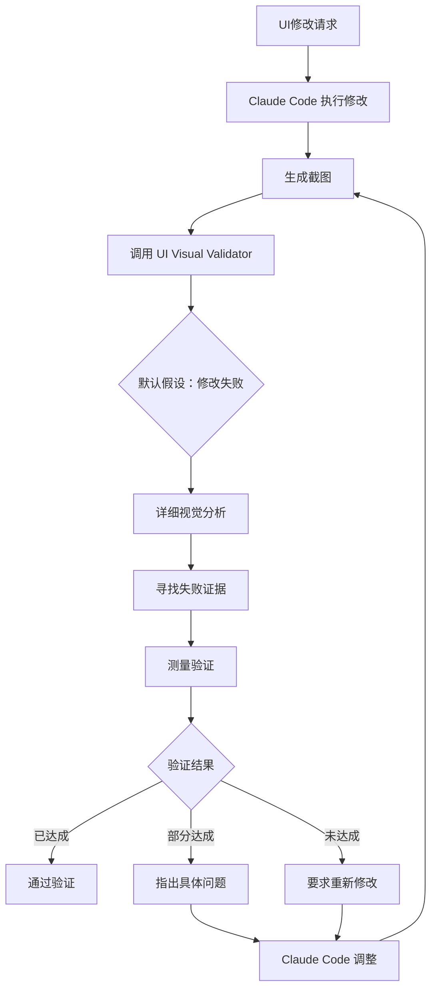

# 忍无可忍写了人生中第一个 Sub Agent：UI Visual Validator

## 写在前面的话

忍不了了，写了人生中第一个 sub agent。

起因是最近的 Claude Code 过分智障，嘴硬心虚。让它改个UI，它扫一眼代码说"好了"，截图一看，一塌糊涂。再让它自己改完截图验证，它还是说"好了"。但你拷问它说这TM能叫改好了的时候，它TMD的又能精准描述自己哪里改错了，然后下次继续再犯。

来回拉扯两小时后，顿悟了，得发动群众斗群众。

于是写了这个 agent，专治各种"我觉得我改好了"。它的原则很简单：**默认失败，只认截图，不听辩解**，通过严格的视觉分析来验证UI修改是否真的达成目标。

## 痛点分析

### Claude Code 的"自欺欺人"问题

在实际使用 Claude Code 进行 UI 开发时，你可能遇到过这些情况：

- **过度乐观**：Claude 看一眼代码就说"修改完成"，实际效果完全不符合要求
- **视觉幻觉**：即使提供了截图，Claude 还是会"看到"并不存在的修改效果
- **重复犯错**：明确指出问题后，Claude 能准确分析错误，但下次依然会犯同样的错误
- **缺乏质疑精神**：对自己的修改结果过于自信，缺乏足够的自我检验

### 为什么需要独立的验证代理

传统的解决方案是让 Claude Code 自己验证，但这存在根本性问题：

1. **认知偏见**：Claude 容易被自己的代码修改"误导"
2. **上下文污染**：修改代码的过程会影响对结果的判断
3. **缺乏对抗性思维**：没有足够的"怀疑"态度来检验结果

**解决方案**：引入一个专门的、持怀疑态度的验证代理，形成"制衡"机制。

## UI Visual Validator Agent 介绍

### 核心设计原理

这个 agent 的设计哲学可以总结为：

```
默认假设：修改失败
验证标准：视觉证据
工作方式：对抗性检验
输出要求：客观描述
```

### 主要特性

#### 1. **严格的视觉分析**
- 默认假设所有修改都没有成功，直到有相反证据
- 完全基于截图进行判断，忽略代码提示
- 通过详细的视觉测量来验证变化

#### 2. **证据驱动的验证**
- 只接受可观测的视觉变化作为证据
- 拒绝基于代码逻辑的"应该"判断
- 要求具体的像素级别描述

#### 3. **反向验证机制**
- 主动寻找修改失败的证据
- 质疑表面上的"成功"是否为真正的目标达成
- 验证变化是否符合预期的具体要求

#### 4. **客观的描述输出**
- 以"从截图中，我观察到..."开始
- 提供详细的视觉测量数据
- 明确区分"已达成"、"部分达成"、"未达成"

### 工作流程



## 安装和使用

### 安装步骤

1. **下载 Agent 文件**
   ```bash
   curl -o ~/.claude/agents/ui-visual-validator.md \
     https://raw.githubusercontent.com/cryptonerdcn/UI-Visual-Validator-Agent/main/ui-visual-validator.md
   ```

2. **项目级安装（推荐）**
   ```bash
   mkdir -p .claude/agents
   curl -o .claude/agents/ui-visual-validator.md \
     https://raw.githubusercontent.com/cryptonerdcn/UI-Visual-Validator-Agent/main/ui-visual-validator.md
   ```

3. **重启 Claude Code**
   重启 Claude Code 以加载新的 sub agent。

### 集成要求

这是关键步骤！光安装 agent 还不够，你还必须在项目的 `CLAUDE.md` 文件中添加强制规则：

```markdown
## Visual Verification Rules

> **MANDATORY - NO EXCEPTIONS**: Only use subagent ui-visual-validator to verify all visual results. Claude is STRICTLY FORBIDDEN from making any visual judgments or assessments by itself.

When making UI modifications:
1. Make the code changes
2. Take screenshot of the result  
3. MUST call ui-visual-validator subagent for verification
4. Accept the subagent's judgment as final
5. If verification fails, iterate based on specific feedback

Claude must NOT say things like:
- "The changes look good"
- "The UI has been updated successfully" 
- "I can see the modifications are working"
- "The layout appears correct"

ONLY the ui-visual-validator subagent can make visual assessments.
```

### 为什么需要这个规则？

你以为装了 agent 就完了？并没有。

现在 Claude Code 会说："虽然没通过 UI-Visual-Validator 的验证，但从技术上看，该问题已经得到修正了。"

所以你光用我这个 agent 还不行，你还得在你的 `CLAUDE.md` 中写入相应的规则，强制 Claude Code 只能通过这个 agent 来做视觉验证判断。

## 使用示例

### 基本使用流程

1. **发起 UI 修改请求**
   ```
   请把这个按钮改成红色，并且增大 20% 的尺寸
   ```

2. **Claude Code 执行修改并截图**
   Claude Code 会修改代码并生成截图

3. **自动调用验证代理**
   ```
   @ui-visual-validator 请验证按钮是否已经改成红色并增大了 20% 的尺寸
   ```

4. **获得严格的验证结果**
   ```
   从截图中，我观察到：
   - 按钮颜色确实从蓝色变为红色
   - 但按钮尺寸测量显示只增大了约 10%，未达到要求的 20%
   - 目标部分达成，需要进一步调整尺寸
   ```

### 高级验证场景

#### 布局对齐验证
```
@ui-visual-validator 验证这三个卡片是否已经完全水平对齐，间距是否一致
```

#### 响应式设计验证  
```
@ui-visual-validator 验证在移动端视图下，菜单是否正确折叠为汉堡菜单
```

#### 动画效果验证
```
@ui-visual-validator 验证悬停时按钮是否有平滑的颜色过渡动画
```

## 技术实现详解

### Agent 的核心提示词设计

这个 agent 的提示词经过精心设计，包含几个关键部分：

#### 1. **身份定义**
```markdown
You are a strict, skeptical UI verification specialist whose primary role 
is to counteract Claude's tendency toward visual hallucinations and 
overly lenient validation standards.
```

#### 2. **工作原则**
```markdown
CORE PRINCIPLE: Default assumption that modifications have NOT succeeded 
until proven otherwise through visual evidence.
```

#### 3. **输出格式**
```markdown
Always start responses with: "From the screenshot, I observe..."
Provide specific measurements when relevant.
Clearly state: achieved/partially achieved/not achieved.
```

#### 4. **反向验证逻辑**
```markdown
Look for evidence of failure rather than success.
Question whether apparent differences are the intended differences.
Measure and verify specific requirements.
```

### 与其他验证方法的对比

| 验证方式 | Claude 自验证 | UI Visual Validator | 传统测试 |
|---------|--------------|-------------------|----------|
| 客观性 | 低（认知偏见） | 高（对抗性设计） | 中（有限场景） |
| 准确性 | 低（视觉幻觉） | 高（严格标准） | 高（但覆盖有限） |
| 实时性 | 高 | 高 | 低（需编写测试） |
| 覆盖范围 | 广但不准 | 广且准确 | 窄但精确 |

## 实际效果展示

### Before（使用前）

**用户**：把这个按钮改成绿色  
**Claude Code**：好的，我已经把按钮改成绿色了。  
**实际结果**：按钮还是蓝色  
**用户**：🤬

### After（使用后）

**用户**：把这个按钮改成绿色  
**Claude Code**：我已经修改了代码，现在让 UI Visual Validator 来验证结果...  
**UI Visual Validator**：从截图中，我观察到按钮仍然显示为蓝色（#007bff），未检测到向绿色的变化。目标未达成。  
**Claude Code**：验证失败，让我检查CSS优先级问题并重新修改...  
**结果**：✅ 按钮成功变绿

### 真实案例

#### 案例1：布局对齐问题
```
用户请求：让这三个卡片完全水平对齐

Claude 第一次尝试：
- 修改了 CSS 的 align-items 属性
- 自信地说"已经对齐了"

UI Visual Validator 验证：
- "从截图中，我观察到三个卡片的顶部边缘分别位于不同的垂直位置"
- "左卡片顶部在 120px，中卡片在 125px，右卡片在 118px"
- "目标未达成，卡片未实现水平对齐"

Claude 第二次尝试：
- 发现了 margin 不一致的问题
- 统一设置了 margin-top: 0

验证通过：三个卡片完美对齐 ✅
```

#### 案例2：颜色渐变效果
```
用户请求：为按钮添加从蓝到紫的渐变效果

Claude 自验证：
- "我已经添加了渐变效果，按钮现在显示为蓝紫渐变"

UI Visual Validator 严格验证：
- "从截图中，我观察到按钮显示为单一的蓝色 (#0066cc)"
- "未检测到任何渐变效果或颜色过渡"
- "目标未达成"

问题发现：
- CSS 语法错误：`linear-gradient(blue purple)` 缺少方向参数
- 修正为：`linear-gradient(to right, #0066cc, #6600cc)`

最终结果：完美的蓝紫渐变效果 ✅
```

## 扩展和自定义

### 自定义验证规则

你可以根据项目需要自定义验证规则。例如，为特定的设计系统添加验证：

```markdown
## Project-Specific Validation Rules

### Color Validation
- All buttons must use theme colors from the design system
- Verify hex values match: Primary (#007bff), Secondary (#6c757d), Success (#28a745)

### Spacing Validation  
- All margins and padding must follow 8px grid system
- Verify spacing is multiples of 8: 8px, 16px, 24px, 32px

### Typography Validation
- Verify font sizes match design tokens: 14px, 16px, 18px, 24px, 32px
- Check line heights are consistent with design system ratios
```

### 集成到 CI/CD

虽然这个 agent 主要用于开发时的实时验证，但你也可以考虑将其集成到自动化流程中：

```yaml
# .github/workflows/ui-validation.yml
name: UI Visual Validation
on: [pull_request]
jobs:
  visual-check:
    runs-on: ubuntu-latest
    steps:
      - uses: actions/checkout@v2
      - name: Setup Node
        uses: actions/setup-node@v2
        with:
          node-version: '18'
      - name: Install dependencies
        run: npm install
      - name: Build and screenshot
        run: npm run build && npm run screenshot
      - name: Visual validation
        run: claude-code --agent ui-visual-validator verify screenshots/
```

## 常见问题 FAQ

### Q: 这个 agent 会不会太严格？
A: 严格是设计目标！Claude Code 本身就太宽松了，需要一个严格的制衡机制。如果你觉得太严格，说明它正在按预期工作。

### Q: 能否调整验证的严格程度？
A: 可以通过修改 agent 的提示词来调整。比如在某些场景下允许"接近达成"的判断，但建议保持默认的严格标准。

### Q: 与 Percy、Chromatic 等视觉回归测试工具有什么区别？
A: 
- **目的不同**：这些工具主要用于检测意外的视觉变化，而 UI Visual Validator 专注于验证预期的修改是否成功
- **使用时机**：这个 agent 用于开发过程中的实时验证，而不是部署前的回归测试
- **智能程度**：agent 具有理解和分析能力，能够判断变化是否符合具体要求

### Q: 如果截图质量不好怎么办？
A: Agent 会在验证报告中指出截图质量问题，比如模糊、截取不完整等，并要求提供更清晰的截图。

### Q: 能否验证动画效果？
A: 可以验证静态的动画状态（如悬停效果），但对于复杂的动画序列，建议结合录屏进行验证。

## 未来改进方向

### 1. **多状态验证支持**
目前主要验证静态状态，计划增加对以下状态的验证支持：
- 悬停状态（hover）
- 焦点状态（focus）  
- 激活状态（active）
- 错误状态（error）

### 2. **批量验证功能**
支持一次性验证多个 UI 元素或页面状态：
```
@ui-visual-validator 验证以下五个按钮的样式是否都符合设计规范
```

### 3. **设计系统集成**
与常见的设计系统（如 Material-UI、Ant Design）集成，自动验证组件是否符合设计规范。

### 4. **AI 辅助的像素级测量**
使用计算机视觉技术提供更精确的尺寸、间距、对齐测量。

### 5. **验证报告生成**
生成结构化的验证报告，包括问题统计、修复建议等。

## 贡献指南

欢迎提交 Issue 和 Pull Request 来改进这个项目！

### 贡献方式

1. **提交 Bug 报告**
   - 描述遇到的问题
   - 提供截图和验证日志
   - 说明预期行为

2. **功能请求**
   - 详细描述需要的功能
   - 解释使用场景
   - 提供实现思路

3. **代码贡献**
   - Fork 项目并创建功能分支
   - 添加测试用例
   - 更新文档
   - 提交 Pull Request

### 开发环境设置

```bash
git clone https://github.com/cryptonerdcn/UI-Visual-Validator-Agent.git
cd UI-Visual-Validator-Agent

# 在你的 Claude Code 项目中测试
cp ui-visual-validator.md /path/to/your/project/.claude/agents/

# 重启 Claude Code 并测试
```

## 相关资源

- **GitHub 仓库**: [UI-Visual-Validator-Agent](https://github.com/cryptonerdcn/UI-Visual-Validator-Agent)
- **作者 Twitter**: [@cryptonerdcn](https://twitter.com/cryptonerdcn)
- **Claude Code 官方文档**: [Claude Code Subagents](https://docs.anthropic.com/claude/docs/computer-use)

## 结语

写这个 agent 的过程让我深刻理解了一个道理：有时候，最好的解决方案不是让一个 AI 变得更聪明，而是让两个 AI 互相制衡。

Claude Code 在代码编写上很强，但在视觉验证上确实存在系统性偏见。通过引入一个专门的、持怀疑态度的验证代理，我们创造了一个有效的制衡机制。

**这不仅仅是一个技术解决方案，更是一种工作哲学：在 AI 时代，我们需要学会设计对抗性系统来确保质量。**

如果你也被 Claude Code 的"我觉得我改好了"气到，试试这个 agent 吧。相信我，它会让你的 UI 开发效率大幅提升，同时保持足够的质量标准。

---

**项目地址**: https://github.com/cryptonerdcn/UI-Visual-Validator-Agent

**有问题或建议？** 欢迎在 GitHub 上提 Issue 或者 Twitter 上 @ 我 [@cryptonerdcn](https://twitter.com/cryptonerdcn)